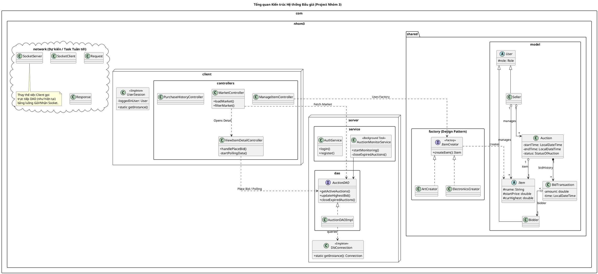

# Project-Nhom-3
Phuc Anh: Auto-Bidding
Doanh:Gia hạn phiên đấu giá
Dung: Bid History Visualization: biểu đồ đường giá realtime
Quang Anh: tinh nang phu
Quang Anh: JavaFx
network: Doanh + Phuc Anh
Xu ly loi: Lam chung
Realtime update (Observer/Socket):Phuc Anh
Unit Test, CI/CD: Dung
Refactor: Doanh
Tuan 7: Hieu code

<pre>
## 🏗️ Kiến trúc Hệ thống (Architecture)
Dự án được xây dựng theo mô hình **Client - Server**, áp dụng các Design Pattern cốt lõi như `Singleton` và `Factory Method`.

