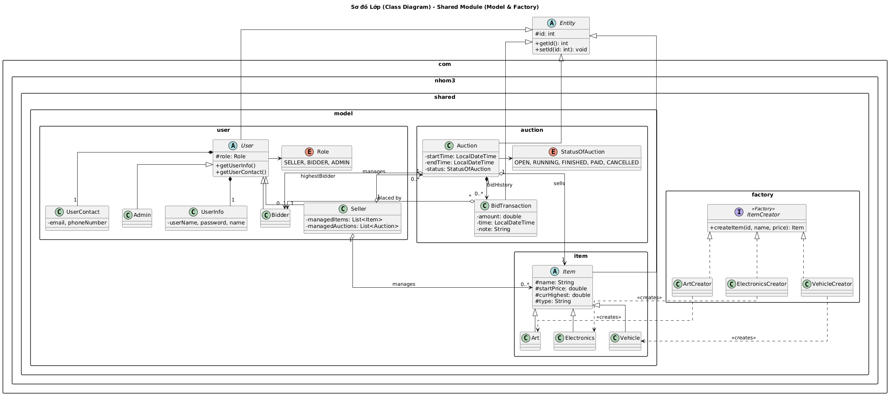
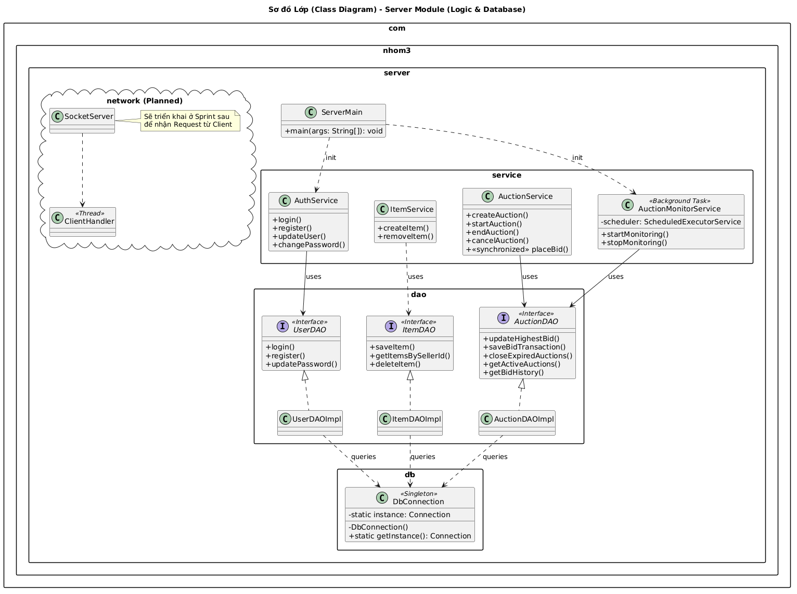
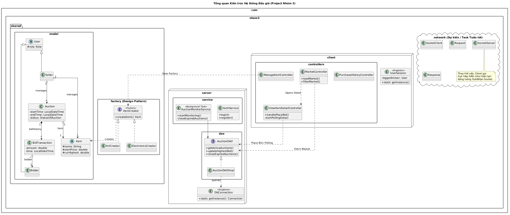

# Project Nhom 3

# 📑 TIẾN ĐỘ THỰC HIỆN BÀI TẬP LỚN: HỆ THỐNG ĐẤU GIÁ TRỰC TUYẾN

### 1. Phúc Anh
- [ ] **Kiến trúc hệ thống:** Thiết lập mô hình Client-Server
- [ ] **Giao tiếp dữ liệu:** Thiết kế cấu trúc gói tin JSON để trao đổi giữa Client và Server.
- [ ] **Logic Đấu giá:** Viết hàm xử lý đặt giá.
- [ ] **Realtime Update:** Triển khai mô hình Observer để Server đẩy thông báo giá mới cho tất cả Client ngay lập tức.
- [ ] **Auto-Bidding:** Lập trình thuật toán tự động đặt giá.

### 2. Doanh 
- [x] **Tầng Dữ liệu (DAO):** Viết các lớp DAO để truy xuất và cập nhật cơ sở dữ liệu.
- [x] **Xử lý đồng thời:**
- [x] **Quản lý sản phẩm:** Viết Logic nghiệp vụ cho các chức năng Thêm/Xóa sản phẩm.
- [x] **Quản lý phiên đấu giá:** Xử lý logic tự động đóng phiên khi hết thời gian và chuyển trạng thái.
- [x] **Thiết kế hướng đối tượng:** Xây dựng cây kế thừa + design pattern(factory)
- [x] **Anti-sniping:** Viết thuật toán tự động gia hạn thêm 120 giây khi có người đặt giá ở 30 giây cuối.
- [ ] **Network:** Viết network cơ bản của server và shared
- [ ] **Setup Dự án/Refactor code:** Cấu hình Build tool (Maven) và Coding convention
### 3. Dũng 
- [ ] **Quản lý người dùng:** Viết logic Đăng ký/Đăng nhập và phân quyền.
- [ ] **CI/CD:** Thiết lập GitHub Actions để tự động chạy test khi có commit mới.
- [ ] **Unit Test:** Viết các bộ kiểm thử JUnit cho các hàm logic đặt giá và tính toán tiền.
- [ ] **Price Curve:** Viết logic xử lý dữ liệu để vẽ biểu đồ đường diễn biến giá theo thời gian thực.
- [ ] **Màn hình Admin:** 
- [ ] **Màn hình biểu đồ**
### 4. Quang Anh 
- [x] **Thiết kế Layout chính:** Sử dụng FXML để dựng khung cho toàn bộ ứng dụng.
- [x] **Màn hình đăng nhập/đăng ký:** UI cho User mng.
- [x] **Màn hình Dashboard:** Hiển thị danh sách các phiên đấu giá đang diễn ra
- [x] **Màn hình đấu giá trực tiếp:** UI hiển thị chi tiết sản phẩm, đồng hồ đếm ngược và khu vực đặt giá.
- [x] **Màn hình Seller:** Giao diện quản lý dành riêng cho người bán.
- [x] **Màn hình Bidder:** Giao diện quản lý dành riêng cho người mua.
- [ ] **Tích hợp Client:** Gọi các hàm từ phía Client-side để gửi dữ liệu lên Server và nhận phản hồi từ Phúc Anh.
- [ ] **Chức năng phụ:** Viết thêm chức năng nâng cao phụ
### 5. Nhiệm vụ chung (Cả nhóm)
- [x] **Thiết kế CSDL:** Tạo cấu trúc lưu trữ cho Người dùng, Sản phẩm, Phiên đấu giá, Lịch sử đặt giá.
- [ ] **Xử lý lỗi & Ngoại lệ:** Bắt các lỗi kết nối, dữ liệu sai, đặt giá thấp hơn giá hiện tại...
- [ ] **Code Review:** Kiểm tra mã nguồn của nhau để đảm bảo tất cả thành viên đều hiểu code
- [ ] **Hoàn thiện Báo cáo:** Viết tài liệu hướng dẫn cài đặt và mô tả kiến trúc hệ thống.
- [ ] **Kiểm thử cuối cùng:** Chạy demo giả lập nhiều người dùng đặt giá cùng lúc để kiểm tra độ ổn định.
### 6. Các công nghệ sử dụng thêm
- HikariCP connection pool: nhiều kết nối tới database
- SLF4J logging: ghi log chi tiết

##  Shared

##  Server

##  Tổng quan hệ thống đấu giá

